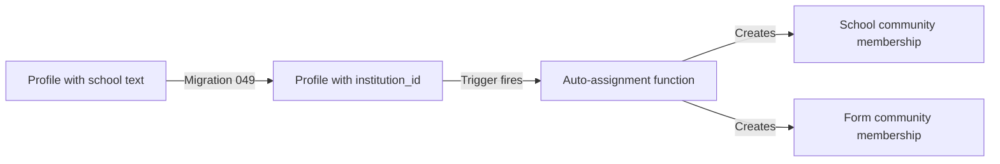

# Fix School Communities Not Showing Up

## The Problem

Students with schools set in their profiles weren't being added to school communities because:

1. **Missing School**: "Presentation College Chaguanas" wasn't in the `institutions` table
2. **Field Mismatch**: Profiles have `school` (text) but auto-assignment uses `institution_id` (UUID)

## The Solution

Three new migrations have been created to fix this:

### Migration 048: Add Missing Schools
**File**: `src/supabase/migrations/048_add_missing_schools.sql`

Adds:
- Presentation College Chaguanas
- Additional schools for better coverage

### Migration 049: Migrate Existing Users
**File**: `src/supabase/migrations/049_migrate_school_to_institution_id.sql`

- Finds matching institutions for profiles with `school` text
- Updates profiles with proper `institution_id`
- Triggers auto-assignment to school/form communities

## How to Apply the Fix

### Step 1: Run the new migrations

```bash
# In Supabase SQL Editor, run in order:
1. 048_add_missing_schools.sql
2. 049_migrate_school_to_institution_id.sql
```

### Step 2: Verify the fix

After running the migrations, check:

1. **Institutions table** should now have "Presentation College Chaguanas"
2. **Profiles** should have `institution_id` set (not just text `school`)
3. **Community memberships** should be created automatically

### Step 3: Test with your student account

1. Log in as the student
2. Go to `/communities`
3. You should see:
   - "Presentation College Chaguanas" (school community)
   - "Presentation College Chaguanas - Form X" (if form_level is set)

## How It Works



1. **Migration 048** adds missing schools to institutions table
2. **Migration 049** updates profiles: `school` text → `institution_id` UUID
3. **Existing trigger** (from migration 045) detects the `institution_id` change
4. **Auto-assignment function** creates school/form communities if they don't exist
5. **Community memberships** are created automatically

## Checking Logs

The migration will output:
```
✅ Migration complete:
   - X profiles matched and updated
   - Y profiles unmatched (manual review needed)
```

If a school is unmatched, it means it's not in the institutions table and needs to be added manually.

## Manual Fix (If Needed)

If a specific student still isn't showing communities:

```sql
-- 1. Find the institution_id for their school
SELECT id, name FROM institutions WHERE name ILIKE '%Presentation%Chaguanas%';

-- 2. Update the student's profile (replace UUIDs)
UPDATE profiles
SET institution_id = '<institution_uuid>', form_level = 'Form 5'
WHERE id = '<student_uuid>';

-- The trigger will automatically create memberships!
```

## Future Prevention

Going forward, use `institution_id` when creating/updating profiles:

### In Signup/Profile Forms:
1. Fetch list of institutions from the database
2. Show dropdown with institution names
3. Store the `institution_id` (not the text name)
4. Auto-assignment will happen automatically on profile creation/update

### Example API Usage:
```typescript
// Fetch institutions for dropdown
const { data: institutions } = await supabase
  .from('institutions')
  .select('id, name')
  .eq('is_active', true)
  .order('name');

// Save with institution_id
await supabase
  .from('profiles')
  .update({ 
    institution_id: selectedInstitutionId,
    form_level: 'Form 5'
  })
  .eq('id', userId);

// Auto-assignment happens via trigger! ✨
```

## Troubleshooting

### Communities still not showing?

1. **Check institution_id is set:**
   ```sql
   SELECT id, school, institution_id, form_level 
   FROM profiles 
   WHERE id = '<student_uuid>';
   ```

2. **Check if communities exist:**
   ```sql
   SELECT * FROM communities 
   WHERE institution_id = '<institution_uuid>';
   ```

3. **Check memberships:**
   ```sql
   SELECT * FROM community_memberships 
   WHERE user_id = '<student_uuid>';
   ```

4. **Manually trigger assignment:**
   ```sql
   -- This will create missing memberships
   UPDATE profiles
   SET institution_id = institution_id -- Dummy update to trigger
   WHERE id = '<student_uuid>';
   ```

## Summary

- ✅ Migration 048 adds missing schools
- ✅ Migration 049 migrates existing users
- ✅ Trigger automatically creates communities and memberships
- ✅ Future users will be auto-assigned on signup if using institution_id


