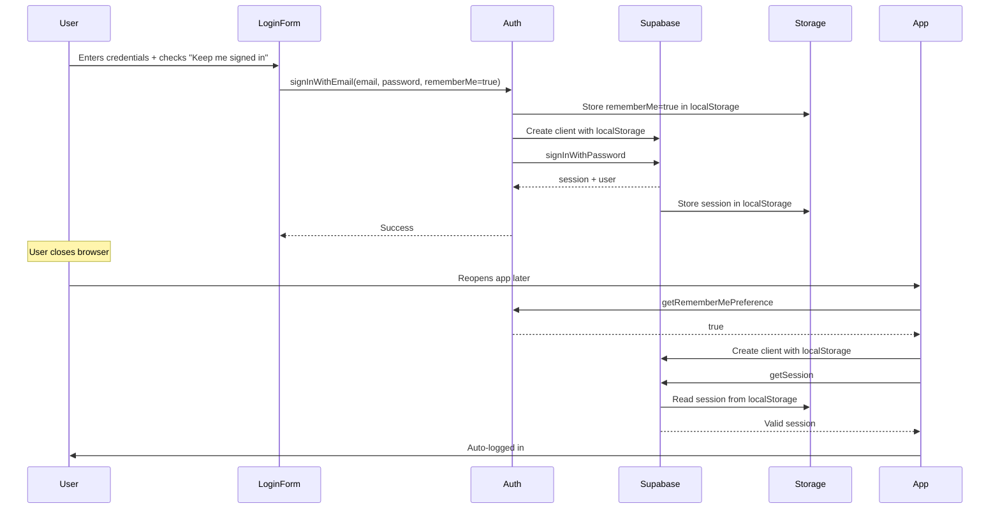

# Keep Me Signed In - Integration Guide

## Overview

This implementation adds a "Keep me signed in" checkbox to your login form that controls Supabase session persistence:

- **Checked:** Session stored in `localStorage` (survives browser restart)
- **Unchecked:** Session stored in `sessionStorage` (ends when tab closes)

## Files Created

```
src/
├── lib/
│   ├── supabase.ts          # Supabase client with configurable storage
│   └── auth.ts              # Sign in/out utilities + remember-me preference
├── hooks/
│   └── useAuth.ts           # Session management hook (auto-login, state)
└── components/
    └── LoginForm.tsx        # Login UI with "Keep me signed in" checkbox
```

---

## Quick Start

### 1. Update your login page

Replace your existing login page with the new `LoginForm`:

```tsx
// pages/login.tsx or app/login/page.tsx
import { LoginForm } from '@/components/LoginForm';
import { useAuth } from '@/hooks/useAuth';
import { useRouter } from 'next/navigation'; // or 'next/router' for Pages Router

export default function LoginPage() {
  const { signIn } = useAuth();
  const router = useRouter();

  return (
    <div style={{ display: 'flex', justifyContent: 'center', alignItems: 'center', minHeight: '100vh' }}>
      <LoginForm
        onSignIn={signIn}
        onSuccess={() => router.push('/dashboard')}
      />
    </div>
  );
}
```

---

### 2. Wrap your app with auth state

Create an auth provider or use `useAuth` at the app level:

#### Option A: Direct usage in layout (App Router)

```tsx
// app/layout.tsx
'use client';
import { useAuth } from '@/hooks/useAuth';
import { usePathname, useRouter } from 'next/navigation';
import { useEffect } from 'react';

export default function RootLayout({ children }: { children: React.ReactNode }) {
  const { user, loading } = useAuth();
  const pathname = usePathname();
  const router = useRouter();

  useEffect(() => {
    // Redirect to login if not authenticated (except on public pages)
    if (!loading && !user && pathname !== '/login') {
      router.push('/login');
    }
  }, [user, loading, pathname, router]);

  if (loading) {
    return <div>Loading...</div>;
  }

  return (
    <html lang="en">
      <body>{children}</body>
    </html>
  );
}
```

#### Option B: Auth context provider (recommended for larger apps)

```tsx
// contexts/AuthContext.tsx
'use client';
import { createContext, useContext, ReactNode } from 'react';
import { useAuth, UseAuthResult } from '@/hooks/useAuth';

const AuthContext = createContext<UseAuthResult | undefined>(undefined);

export function AuthProvider({ children }: { children: ReactNode }) {
  const auth = useAuth();
  return <AuthContext.Provider value={auth}>{children}</AuthContext.Provider>;
}

export function useAuthContext() {
  const context = useContext(AuthContext);
  if (!context) {
    throw new Error('useAuthContext must be used within AuthProvider');
  }
  return context;
}
```

Then wrap your app:

```tsx
// app/layout.tsx
import { AuthProvider } from '@/contexts/AuthContext';

export default function RootLayout({ children }: { children: React.ReactNode }) {
  return (
    <html lang="en">
      <body>
        <AuthProvider>{children}</AuthProvider>
      </body>
    </html>
  );
}
```

---

### 3. Protect routes

Create a protected route wrapper:

```tsx
// components/ProtectedRoute.tsx
'use client';
import { useAuth } from '@/hooks/useAuth';
import { useRouter } from 'next/navigation';
import { useEffect } from 'react';

export function ProtectedRoute({ children }: { children: React.ReactNode }) {
  const { user, loading } = useAuth();
  const router = useRouter();

  useEffect(() => {
    if (!loading && !user) {
      router.push('/login');
    }
  }, [user, loading, router]);

  if (loading) {
    return <div>Loading...</div>;
  }

  if (!user) {
    return null;
  }

  return <>{children}</>;
}
```

Use in your protected pages:

```tsx
// app/dashboard/page.tsx
import { ProtectedRoute } from '@/components/ProtectedRoute';

export default function DashboardPage() {
  return (
    <ProtectedRoute>
      <h1>Dashboard</h1>
      {/* Your dashboard content */}
    </ProtectedRoute>
  );
}
```

---

### 4. Add logout functionality

```tsx
// components/LogoutButton.tsx
'use client';
import { useAuth } from '@/hooks/useAuth';
import { useRouter } from 'next/navigation';

export function LogoutButton() {
  const { signOut } = useAuth();
  const router = useRouter();

  const handleLogout = async () => {
    await signOut();
    router.push('/login');
  };

  return (
    <button onClick={handleLogout}>
      Sign Out
    </button>
  );
}
```

---

## How It Works

### Session Persistence Flow



### Without "Keep me signed in"

When the checkbox is **unchecked**:
1. Session stored in `sessionStorage`
2. Session persists during page refreshes
3. Session **cleared** when tab/browser closes
4. User must log in again on next visit

---

## API Reference

### `createSupabaseClient(persistSession: boolean)`

Creates a Supabase client with the specified storage.

```ts
import { createSupabaseClient } from '@/lib/supabase';

// Persistent session (localStorage)
const supabase = createSupabaseClient(true);

// Session-only (sessionStorage)
const supabase = createSupabaseClient(false);
```

---

### `signInWithEmail(email, password, rememberMe)`

Signs in a user and stores the preference.

```ts
import { signInWithEmail } from '@/lib/auth';

const { user, session, error } = await signInWithEmail(
  'user@example.com',
  'password123',
  true // Keep me signed in
);
```

---

### `signOut()`

Signs out the user and clears all session data.

```ts
import { signOut } from '@/lib/auth';

const { error } = await signOut();
```

---

### `useAuth()`

React hook for auth state management.

```ts
import { useAuth } from '@/hooks/useAuth';

function MyComponent() {
  const { user, session, loading, signIn, signOut } = useAuth();
  
  if (loading) return <div>Loading...</div>;
  if (!user) return <LoginForm onSignIn={signIn} />;
  
  return (
    <div>
      <p>Welcome, {user.email}</p>
      <button onClick={signOut}>Logout</button>
    </div>
  );
}
```

---

## Edge Cases Handled

### 1. Logout clears everything

Both `localStorage` and `sessionStorage` are cleared on logout to prevent leftover sessions.

### 2. Token refresh works automatically

Supabase's `autoRefreshToken: true` ensures tokens are refreshed regardless of storage type.

### 3. Multiple tabs

- **localStorage (persistent):** All tabs share the same session
- **sessionStorage (tab-only):** Each tab has its own session

### 4. Session expiry

If a session expires, `useAuth` will detect it via `onAuthStateChange` and update the state automatically.

---

## Security Notes

1. **HTTPS only:** Always use HTTPS in production. Supabase sessions should never be transmitted over HTTP.

2. **Token storage:** Both `localStorage` and `sessionStorage` are vulnerable to XSS attacks. Ensure your app sanitizes user input and follows security best practices.

3. **Remember-me preference:** Stored separately in `localStorage` so the app knows which storage to use before loading the session.

4. **Logout on shared devices:** Remind users to uncheck "Keep me signed in" on shared/public computers.

---

## Testing Checklist

After integration, test these scenarios:

### ✅ "Keep me signed in" checked

- [ ] Login with checkbox checked
- [ ] Refresh page → still logged in
- [ ] Close browser completely
- [ ] Reopen browser and navigate to app → auto-logged in
- [ ] Open new tab → logged in (shared session)

### ✅ "Keep me signed in" unchecked

- [ ] Login with checkbox unchecked
- [ ] Refresh page → still logged in
- [ ] Close tab and reopen → logged out
- [ ] Open new tab → not logged in (separate session)

### ✅ Logout

- [ ] Logout from one tab
- [ ] Check other tabs → also logged out
- [ ] Reopen browser → not logged in
- [ ] Verify both localStorage and sessionStorage cleared

### ✅ Token refresh

- [ ] Stay logged in for > 1 hour
- [ ] Perform an action requiring auth
- [ ] Verify token was refreshed automatically (no logout)

### ✅ Session expiry

- [ ] Manually delete session from storage (dev tools)
- [ ] Refresh page
- [ ] Verify user is logged out and redirected to login

---

## Troubleshooting

### Issue: User not auto-logged in after browser restart

**Check:**
1. Was "Keep me signed in" checked during login?
2. Is the preference stored? Check `localStorage.getItem('itutor_remember_me')`
3. Is the session stored? Check `localStorage` for keys starting with `sb-`

### Issue: Session not ending on tab close

**Check:**
1. Was "Keep me signed in" unchecked?
2. Is the session stored in `sessionStorage` (not `localStorage`)?

### Issue: Token refresh not working

**Check:**
1. `autoRefreshToken: true` is set in `createSupabaseClient`
2. No network errors blocking refresh requests
3. Supabase project settings allow auto-refresh

---

## Customization

### Change the remember-me key

Edit `REMEMBER_ME_KEY` in `src/lib/auth.ts`:

```ts
const REMEMBER_ME_KEY = 'my_app_remember_me';
```

### Customize login form styles

The `LoginForm` uses inline styles. Replace with Tailwind CSS or CSS modules:

```tsx
<input
  className="px-4 py-2 border rounded-md"
  // ...
/>
```

### Add "Forgot Password" link

```tsx
<a href="/reset-password">Forgot password?</a>
```

---

## Support

For Supabase-specific issues, refer to:
- [Supabase Auth Documentation](https://supabase.com/docs/guides/auth)
- [Session Management](https://supabase.com/docs/guides/auth/sessions)
- [Storage Options](https://supabase.com/docs/reference/javascript/initializing#with-additional-parameters)

---

**Implementation Complete!** 🎉

Your iTutor app now supports "Keep me signed in" with secure, production-ready session management.
