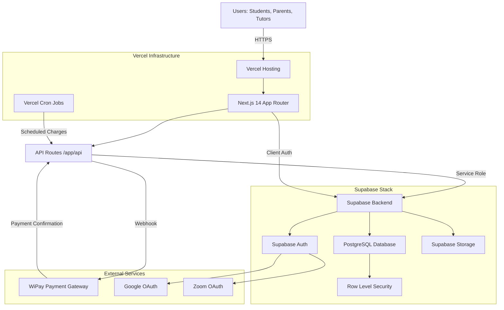
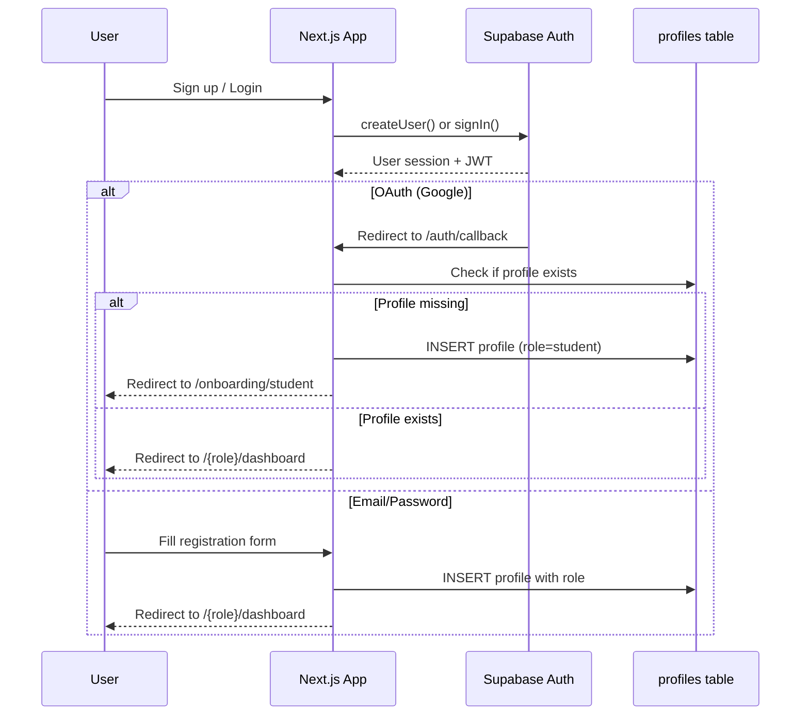
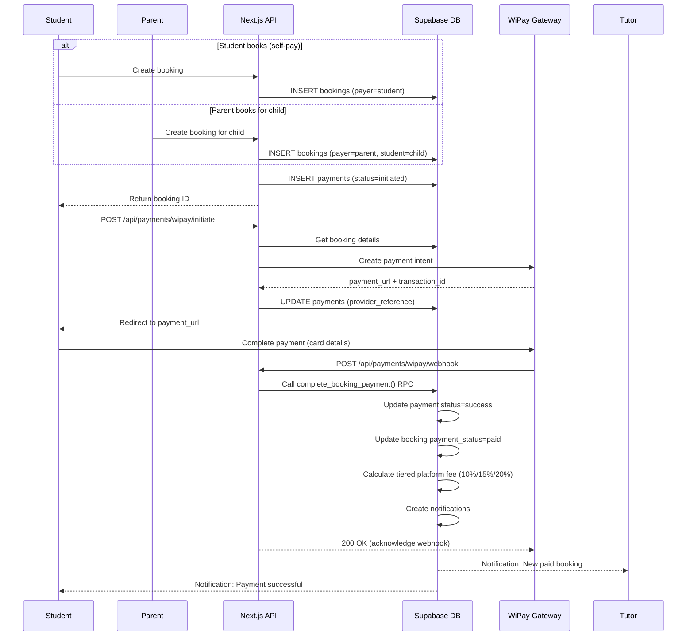
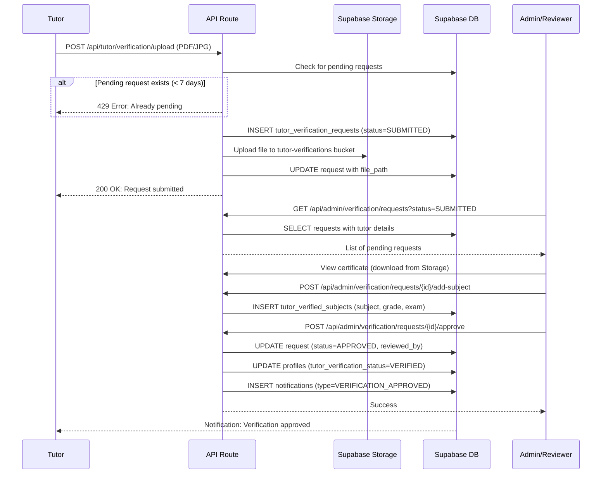
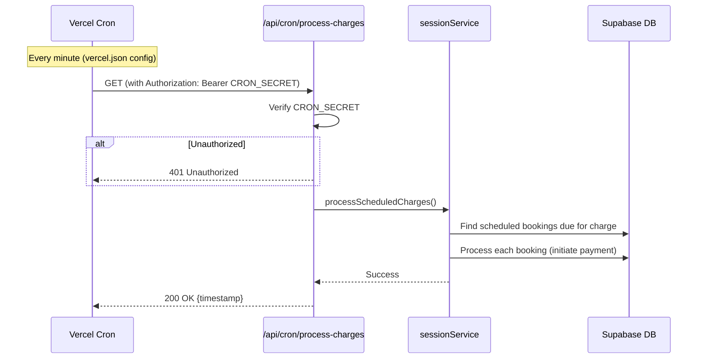
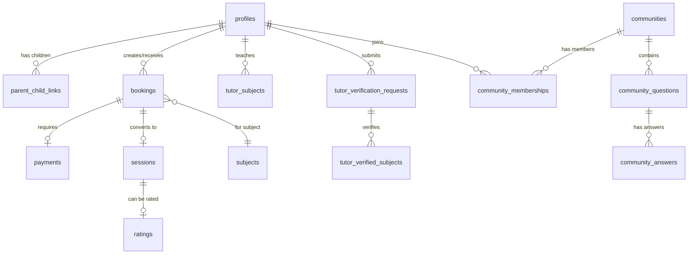
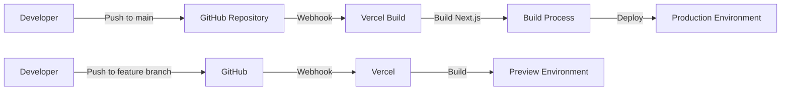
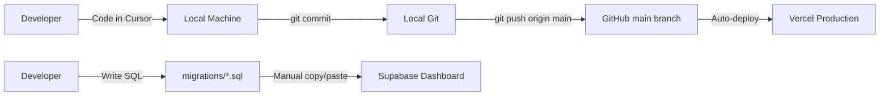
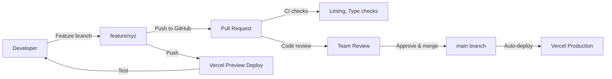

# iTutor Platform — CTO Handover Documentation

**Document Version**: 1.0  
**Last Updated**: January 2026  
**Platform Status**: Production-ready MVP deployed on Vercel  
**Target Market**: Trinidad & Tobago (MVP), Caribbean expansion planned

---

## Executive Summary

iTutor is a **tutoring marketplace platform** connecting students, parents, and tutors in Trinidad & Tobago. The platform handles:

- **User management** (students, parents, tutors, admins, reviewers)
- **Session booking & scheduling** (including parent-managed bookings)
- **Payments in TTD** via WiPay/FAC gateways (tiered platform fees: 10%/15%/20%)
- **Tutor verification** (CXC/CAPE certificate uploads with admin review)
- **Communities & messaging** (school-based forums and direct messaging)
- **Video sessions** (Google Meet + Zoom OAuth integration)

**Tech Stack**:
- **Frontend**: Next.js 14 (App Router), React 18, TailwindCSS
- **Backend**: Supabase (PostgreSQL + Auth + Storage + RLS)
- **Hosting**: Vercel (auto-deploy from GitHub, includes cron jobs)
- **Payments**: WiPay/FAC (Trinidad & Tobago payment gateways)
- **Development**: Cursor IDE with AI pairing

---

## Table of Contents

1. [Architecture Overview](#architecture-overview)
2. [Technology Stack & Services](#technology-stack--services)
3. [Key Domain Flows](#key-domain-flows)
4. [Data Model & Database](#data-model--database)
5. [Deployment & Operations](#deployment--operations)
6. [Development Workflow](#development-workflow)
7. [Tooling Guide](#tooling-guide)
8. [Security & Access Control](#security--access-control)
9. [Monitoring & Incident Response](#monitoring--incident-response)
10. [Future Roadmap & Scaling](#future-roadmap--scaling)

---

## Architecture Overview

### System Architecture



### Architectural Principles

1. **Server-side data fetching**: All sensitive operations use Next.js API routes with Supabase service role key
2. **RLS enforcement**: Client-side queries use anon key + Supabase RLS policies for security
3. **Stateless deployment**: Vercel serverless functions, no sticky sessions needed
4. **PostgreSQL functions**: Complex business logic (payment splits, notifications) in database functions
5. **Storage in Supabase**: All file uploads (avatars, verification docs) stored in Supabase Storage buckets

### Directory Structure

```
iTutor/
├── app/                                    # Next.js 14 App Router
│   ├── (role)/                            # Role-based page routes
│   │   ├── student/                       # Student dashboard, sessions, bookings
│   │   ├── parent/                        # Parent dashboard, child management
│   │   ├── tutor/                         # Tutor dashboard, availability, verification
│   │   └── reviewer/                      # Reviewer (admin-lite) verification queue
│   ├── api/                               # Server-side API routes
│   │   ├── payments/wipay/                # WiPay integration (initiate, webhook)
│   │   ├── cron/process-charges/          # Scheduled payment processing
│   │   ├── admin/                         # Admin-only operations
│   │   ├── communities/                   # Community/forum APIs
│   │   └── tutor/verification/            # Tutor verification upload
│   ├── auth/callback/                     # OAuth callback handler
│   └── layout.tsx                         # Root layout with providers
├── components/                            # Reusable React components
├── lib/                                   # Shared utilities
│   ├── supabase/                          # Supabase client helpers
│   │   ├── client.ts                      # Browser client (lazy-loaded)
│   │   └── server.ts                      # Service role client (server-only)
│   ├── services/                          # Business logic services
│   ├── middleware/                        # Auth guards (requireAdmin, requireTutor)
│   └── types/                             # TypeScript type definitions
├── src/supabase/                          # Database schema & migrations
│   ├── migrations/                        # SQL migration files (000-063)
│   ├── SCHEMA_SUMMARY.md                  # Data model documentation
│   ├── FLOW_SUMMARY.md                    # End-to-end flow diagrams
│   └── RLS_IMPLEMENTATION_GUIDE.md        # RLS policy reference
├── public/                                # Static assets
├── docs/                                  # Technical documentation
├── vercel.json                            # Vercel deployment config (cron jobs)
├── next.config.js                         # Next.js config (standalone output)
├── tailwind.config.ts                     # Tailwind CSS configuration
└── package.json                           # Dependencies
```

---

## Technology Stack & Services

### Frontend Stack

| Technology | Version | Purpose |
|------------|---------|---------|
| **Next.js** | 14.0.4 | React framework with App Router |
| **React** | 18.2.0 | UI library |
| **TypeScript** | 5.x | Type safety |
| **TailwindCSS** | 3.3.0 | Utility-first styling |
| **Heroicons** | 2.2.0 | Icon library |
| **date-fns** | 4.1.0 | Date manipulation |
| **react-markdown** | 10.1.0 | Markdown rendering (communities) |
| **qrcode** | 1.5.4 | QR code generation (video sessions) |

### Backend Stack

| Service | Purpose | Configuration |
|---------|---------|---------------|
| **Supabase** | Backend-as-a-service | PostgreSQL 14+, Auth, Storage, RLS |
| **PostgreSQL** | Primary database | 63+ migrations applied |
| **Supabase Auth** | User authentication | Email/password + OAuth (Google) |
| **Supabase Storage** | File uploads | Buckets: `avatars`, `tutor-verifications` |
| **Vercel** | Hosting & deployment | Auto-deploy from GitHub `main` branch |
| **Vercel Cron** | Scheduled tasks | `/api/cron/process-charges` runs every minute |

### Payment Gateways

| Gateway | Purpose | Integration Type |
|---------|---------|------------------|
| **WiPay** | TTD credit/debit card payments | REST API + Webhooks |
| **FAC** | Trinidad bank transfers | (Placeholder, not yet implemented) |

### OAuth Providers

- **Google OAuth**: For user login + Google Meet video integration
- **Zoom OAuth**: For Zoom video integration (tutors can connect their accounts)

---

## Key Domain Flows

### 1. User Authentication & Profile Bootstrap



**Key Files**:
- [`app/auth/callback/route.ts`](../app/auth/callback/route.ts) - OAuth callback handler
- [`lib/supabase/client.ts`](../lib/supabase/client.ts) - Client-side Supabase client
- Migration [`001_complete_schema_with_rls.sql`](../src/supabase/migrations/001_complete_schema_with_rls.sql) - `profiles` table schema

**Notes**:
- All users get a row in `profiles` table (role determines dashboard access)
- OAuth users get auto-created profiles with `role='student'` by default
- Profile completion checks redirect incomplete profiles to onboarding

---

### 2. Session Booking & Payment Flow



**Key Files**:
- [`app/api/payments/wipay/initiate/route.ts`](../app/api/payments/wipay/initiate/route.ts) - Payment initiation
- [`app/api/payments/wipay/webhook/route.ts`](../app/api/payments/wipay/webhook/route.ts) - Webhook handler
- [`lib/payments/wipayClient.ts`](../lib/payments/wipayClient.ts) - WiPay SDK wrapper
- Migration [`020_payments_system.sql`](../src/supabase/migrations/020_payments_system.sql) - Payments table
- Migration [`021_payment_functions.sql`](../src/supabase/migrations/021_payment_functions.sql) - `complete_booking_payment()` function

**Revenue Split** (Tiered Platform Fees):
- Platform receives 100% from WiPay initially
- PostgreSQL function `compute_platform_fee()` calculates tiered fees:
  - **Bookings < $50 TTD**: 10% platform fee (90% to tutor)
  - **Bookings $50-$199 TTD**: 15% platform fee (85% to tutor)
  - **Bookings ≥ $200 TTD**: 20% platform fee (80% to tutor)
- Tutor earnings tracked in `payout_ledger` table (payout releases require admin approval)

---

### 3. Tutor Verification Flow



**Key Files**:
- [`app/api/tutor/verification/upload/route.ts`](../app/api/tutor/verification/upload/route.ts) - Upload handler
- [`app/api/admin/verification/requests/route.ts`](../app/api/admin/verification/requests/route.ts) - Admin list
- [`app/api/admin/verification/requests/[id]/approve/route.ts`](../app/api/admin/verification/requests/[id]/approve/route.ts) - Approval handler
- Migrations [`024_tutor_verification_schema.sql`](../src/supabase/migrations/024_tutor_verification_schema.sql) & [`032_add_verified_subjects_table.sql`](../src/supabase/migrations/032_add_verified_subjects_table.sql)

**Verification States**:
- `SUBMITTED`: Tutor uploaded document
- `PROCESSING`: Admin is reviewing
- `READY_FOR_REVIEW`: OCR extraction complete (future)
- `APPROVED`: Verified tutor (shows badge on profile)
- `REJECTED`: Admin rejected (can resubmit after 7 days)

---

### 4. Vercel Cron Job (Scheduled Charges)



**Key Files**:
- [`app/api/cron/process-charges/route.ts`](../app/api/cron/process-charges/route.ts) - Cron endpoint
- [`vercel.json`](../vercel.json) - Cron schedule config
- [`lib/services/sessionService.ts`](../lib/services/sessionService.ts) - Business logic

**Configuration**:
```json
{
  "crons": [
    {
      "path": "/api/cron/process-charges",
      "schedule": "* * * * *"
    }
  ]
}
```

**Security**:
- Protected by `CRON_SECRET` environment variable (set in Vercel)
- Only Vercel's cron runner has the secret

---

## Data Model & Database

### High-Level Entity Relationships



### Core Tables (Simplified)

| Table | Purpose | Key Columns |
|-------|---------|-------------|
| **profiles** | All users (student/parent/tutor/admin) | `id`, `role`, `email`, `full_name`, `tutor_verification_status` |
| **parent_child_links** | Parent → child relationships | `parent_id`, `child_id` |
| **subjects** | CSEC/CAPE subject catalog | `id`, `name`, `curriculum`, `level` |
| **tutor_subjects** | Tutors' offered subjects + rates | `tutor_id`, `subject_id`, `price_per_hour_ttd` |
| **bookings** | Session booking requests | `id`, `student_id`, `tutor_id`, `payer_id`, `payment_status` |
| **payments** | Payment records | `id`, `booking_id`, `amount_ttd`, `provider`, `status` |
| **sessions** | Confirmed tutoring sessions | `id`, `booking_id`, `video_provider`, `meeting_url` |
| **ratings** | Post-session feedback | `id`, `session_id`, `student_id`, `tutor_id`, `stars` |
| **tutor_verification_requests** | Certificate uploads | `id`, `tutor_id`, `file_path`, `status` |
| **tutor_verified_subjects** | Admin-approved grades | `id`, `tutor_id`, `subject_name`, `grade`, `exam_type` |
| **communities** | School/form/subject forums | `id`, `type`, `institution_id`, `subject_id` |
| **notifications** | In-app notifications | `id`, `user_id`, `type`, `message`, `is_read` |
| **messages** | Direct messaging | `id`, `conversation_id`, `sender_id`, `content` |

**Full Schema**: See [`src/supabase/SCHEMA_SUMMARY.md`](../src/supabase/SCHEMA_SUMMARY.md) for complete table definitions and relationships.

### Migrations

**Location**: `src/supabase/migrations/`

**Key Migrations**:
- `001_complete_schema_with_rls.sql` - Core tables (profiles, subjects, tutor_subjects)
- `010_create_booking_system.sql` - Booking system tables
- `015_notifications_and_messages.sql` - Notifications & messaging
- `018_sessions_system.sql` - Session tracking
- `020_payments_system.sql` - Payment tables
- `024_tutor_verification_schema.sql` - Verification system
- `042_communities_core.sql` - Community forums
- `052_allow_free_sessions.sql` - Free/trial session support

**Total**: 63 migrations applied (as of January 2026)

**Migration Strategy** (see [Development Workflow](#development-workflow) section):
- Migrations are currently applied **manually via Supabase Dashboard SQL Editor**
- No automated migration runner in production
- ⚠️ **Recommendation for new CTO**: Set up `supabase db push` automation or use Supabase CLI for production deployments

---

## Deployment & Operations

### Vercel Deployment

**Hosting**: [https://vercel.com](https://vercel.com)  
**Project**: iTutor Platform  
**Git Integration**: Auto-deploy from GitHub repository

#### Environments

| Environment | Branch | URL | Purpose |
|-------------|--------|-----|---------|
| **Production** | `main` | `https://itutor-platform.vercel.app` | Live platform |
| **Preview** | Any branch | Auto-generated URLs | PR previews |

#### Deployment Flow



**Build Command**: `npm run build`  
**Output Directory**: `.next` (standalone mode)  
**Framework**: Next.js 14  

#### Environment Variables (Vercel)

| Variable | Purpose | Scope |
|----------|---------|-------|
| `NEXT_PUBLIC_SUPABASE_URL` | Supabase project URL | Production + Preview |
| `NEXT_PUBLIC_SUPABASE_ANON_KEY` | Supabase anon/public key | Production + Preview |
| `SUPABASE_SERVICE_ROLE_KEY` | Service role (bypasses RLS) | **Production only** |
| `CRON_SECRET` | Protects cron endpoints | Production only |
| `NEXT_PUBLIC_APP_URL` | App base URL (for redirects) | Production + Preview |
| `WIPAY_ACCOUNT_NUMBER` | WiPay merchant ID | Production only |
| `WIPAY_API_KEY` | WiPay API key | Production only |

**Setting Environment Variables**:
1. Go to Vercel Dashboard → Project Settings → Environment Variables
2. Add variables with appropriate scopes (Production / Preview / Development)
3. Redeploy to apply changes

---

### Supabase Configuration

**Hosting**: [https://supabase.com](https://supabase.com)  
**Database**: PostgreSQL 14+  
**Region**: (Check your Supabase project settings)

#### Supabase Project Structure

```
Supabase Project
├── Database (PostgreSQL)
│   ├── Tables (63 migrations applied)
│   ├── Functions (complete_booking_payment, etc.)
│   └── RLS Policies (per-table policies)
├── Authentication
│   ├── Providers: Email, Google OAuth
│   └── User Management
├── Storage
│   ├── avatars (public bucket)
│   └── tutor-verifications (private bucket)
└── Edge Functions (not currently used)
```

#### Database Management

**Current Process**:
1. Developer writes SQL in `src/supabase/migrations/XXX_description.sql`
2. Copy SQL content
3. Paste into **Supabase Dashboard → SQL Editor**
4. Click **Run**
5. Verify success in Supabase logs

⚠️ **Issue**: No automated tracking of which migrations are applied  
✅ **Recommendation**: Implement `supabase db push` workflow with migration tracking

#### Storage Buckets

| Bucket | Public? | Purpose | RLS Policies |
|--------|---------|---------|--------------|
| `avatars` | Yes | User profile pictures | Anyone can read, users can upload to own folder |
| `tutor-verifications` | No | CXC certificate uploads | Tutors upload, admins/reviewers read |

**Creating Buckets**:
1. Supabase Dashboard → Storage → Create Bucket
2. Set public/private access
3. Configure RLS policies (see migrations `008_setup_avatars_storage.sql`, `033_verification_storage_policies.sql`)

#### RLS (Row Level Security)

**Philosophy**: All tables have RLS enabled. Policies enforce data access based on authenticated user's role.

**Example Policy** (from `bookings` table):
```sql
-- Students can view their own bookings
CREATE POLICY "Students view own bookings" ON bookings
FOR SELECT USING (student_id = auth.uid());

-- Parents can view child bookings (via parent_child_links)
CREATE POLICY "Parents view child bookings" ON bookings
FOR SELECT USING (
  payer_id = auth.uid() OR
  student_id IN (
    SELECT child_id FROM parent_child_links WHERE parent_id = auth.uid()
  )
);
```

**Service Role Bypass**: API routes using `SUPABASE_SERVICE_ROLE_KEY` bypass all RLS policies (used for payments, admin operations).

**Full RLS Documentation**: [`src/supabase/RLS_IMPLEMENTATION_GUIDE.md`](../src/supabase/RLS_IMPLEMENTATION_GUIDE.md)

---

### Cron Jobs

**Vercel Cron** (configured in `vercel.json`):

```json
{
  "crons": [
    {
      "path": "/api/cron/process-charges",
      "schedule": "* * * * *"
    }
  ]
}
```

**Schedule**: Every minute  
**Endpoint**: `/api/cron/process-charges`  
**Purpose**: Process scheduled session charges (currently placeholder logic)

**Monitoring Cron Jobs**:
1. Vercel Dashboard → Project → Cron Jobs
2. View execution logs
3. Check for failures

---

## Development Workflow

### Current Workflow (Solo Development)



**Process**:
1. **Feature development**: Code locally in Cursor IDE
2. **Cursor AI pairing**: Use Cursor's AI chat for implementation, debugging, and refactoring
3. **Test locally**: `npm run dev` on `localhost:3000`
4. **Commit to main**: `git commit -m "..." && git push origin main`
5. **Vercel auto-deploys**: Production updated in ~2 minutes
6. **Database changes**: Manually run SQL in Supabase Dashboard SQL Editor

### Recommended Workflow (Team Environment)



**Recommended Changes for Team**:

1. **Branch Protection**: Require PRs for `main` branch
2. **Code Reviews**: At least 1 approval before merge
3. **CI/CD Pipeline**: Add GitHub Actions for:
   - `npm run lint`
   - `npm run type-check`
   - `npm run test` (when tests are added)
4. **Migration Tracking**: Use Supabase CLI with migration version tracking
5. **Staging Environment**: Add a `staging` branch + Vercel environment

---

### Local Development Setup

#### Prerequisites

- **Node.js**: 18.x or 20.x
- **npm**: 9.x or higher
- **Git**: Latest version
- **Cursor IDE**: [https://cursor.sh](https://cursor.sh) (or VS Code with Copilot)

#### Setup Steps

1. **Clone Repository**:
   ```bash
   git clone <repository-url>
   cd Pilot
   ```

2. **Install Dependencies**:
   ```bash
   npm install
   ```

3. **Environment Variables**:
   - Copy `env.example` to `.env.local`:
     ```bash
     cp env.example .env.local
     ```
   - Fill in Supabase credentials:
     ```env
     NEXT_PUBLIC_SUPABASE_URL=https://your-project.supabase.co
     NEXT_PUBLIC_SUPABASE_ANON_KEY=your-anon-key-here
     ```
   - Get credentials from: Supabase Dashboard → Settings → API

4. **Run Development Server**:
   ```bash
   npm run dev
   ```
   - Open [http://localhost:3000](http://localhost:3000)

5. **Create Test User**:
   - Sign up via UI, or
   - Manually insert into `profiles` table via Supabase Dashboard

#### Verifying Setup

- ✅ App loads without errors
- ✅ Can sign up / log in
- ✅ Dashboard redirects based on role
- ✅ No RLS policy violations in browser console

---

## Tooling Guide

### 1. Cursor IDE (Primary Development Tool)

**How Cursor was used in this project**:
- **AI pairing workflow**: Developer works iteratively with Cursor's AI assistant
- **Implementation pattern**:
  1. Developer describes feature or problem
  2. Cursor suggests implementation (code, SQL, config)
  3. Developer reviews, refines prompt, iterates
  4. Developer tests locally and commits
- **Common use cases**:
  - Generating API routes (e.g., payment webhooks)
  - Writing Supabase RLS policies
  - Debugging RLS permission errors
  - Refactoring components for reusability
  - Writing SQL migrations

**Best Practices for AI Pairing**:
- ✅ **Be specific**: "Create a POST route at /api/payments/wipay/webhook that verifies signatures and calls complete_booking_payment RPC"
- ✅ **Provide context**: Include error messages, stack traces, relevant files
- ✅ **Review AI output**: Always read generated code for security issues (SQL injection, exposed keys)
- ✅ **Iterate**: If output isn't right, refine the prompt with more details
- ❌ **Don't blindly copy**: Understand what the AI generated before committing

**Cursor Settings** (recommended):
- Enable "Use Cursor Tab" for inline suggestions
- Set up keyboard shortcuts for "Ask Cursor" (Ctrl+K or Cmd+K)
- Configure `.cursorrules` file in project root (if not already present)

---

### 2. GitHub

**Current Setup**:
- **Repository**: (Private GitHub repo linked to Vercel)
- **Branch Strategy**: Single `main` branch (solo development)
- **No PR reviews**: Direct commits to `main`
- **No CI/CD**: Relying on Vercel's build process

**Recommended Team Setup**:

```
main (protected)
  ├── develop (integration branch)
  │   ├── feature/booking-calendar
  │   ├── feature/rating-system
  │   └── bugfix/payment-webhook
  └── hotfix/critical-bug
```

**Branch Protection Rules** (for `main`):
- Require pull request before merging
- Require 1+ approvals
- Require status checks to pass (CI)
- Enforce branch up-to-date before merge

**GitHub Actions** (not yet implemented):

```yaml
# .github/workflows/ci.yml
name: CI
on: [pull_request]
jobs:
  lint-and-typecheck:
    runs-on: ubuntu-latest
    steps:
      - uses: actions/checkout@v3
      - uses: actions/setup-node@v3
        with:
          node-version: 20
      - run: npm ci
      - run: npm run lint
      - run: npm run type-check
```

---

### 3. Supabase

**Current Workflow**:
- **Schema changes**: Manual SQL in Dashboard SQL Editor
- **Tracking**: Migration files in `src/supabase/migrations/` (not auto-applied)
- **Storage**: Manual bucket creation + RLS policy setup
- **Functions**: PostgreSQL functions defined in migrations (e.g., `complete_booking_payment`)

**Recommended Workflow** (Supabase CLI):

1. **Install Supabase CLI**:
   ```bash
   npm install -g supabase
   ```

2. **Link Project**:
   ```bash
   supabase login
   supabase link --project-ref your-project-ref
   ```

3. **Apply Migrations**:
   ```bash
   supabase db push
   ```
   - Automatically tracks applied migrations
   - Prevents re-running old migrations

4. **Generate TypeScript Types**:
   ```bash
   supabase gen types typescript --linked > lib/types/database.types.ts
   ```

**Migration Discipline**:
- ✅ **Never edit applied migrations** - create new ones
- ✅ **Test migrations locally** before production
- ✅ **Use transactions** for multi-statement migrations
- ✅ **Document breaking changes** in migration comments
- ❌ **Never drop tables** in production without backups

---

### 4. Vercel

**Current Setup**:
- **Auto-deploy**: Every push to `main` triggers production deploy
- **Preview deploys**: Every push to feature branches (if enabled)
- **Cron jobs**: Configured in `vercel.json` (runs `/api/cron/process-charges` every minute)
- **Environment variables**: Managed via Vercel Dashboard

**Vercel CLI** (for manual deploys):

```bash
# Install Vercel CLI
npm install -g vercel

# Login
vercel login

# Deploy to preview
vercel

# Deploy to production
vercel --prod
```

**Monitoring Deploys**:
1. Vercel Dashboard → Project → Deployments
2. View build logs for errors
3. Check function logs for runtime errors

**Rollback Strategy**:
1. Go to Vercel Dashboard → Deployments
2. Find last working deployment
3. Click "..." → Promote to Production
4. Or: `git revert` bad commit and push to `main`

---

## Security & Access Control

### Authentication

**Provider**: Supabase Auth  
**Methods**: Email/password, Google OAuth  
**Session Management**: JWT tokens stored in HTTP-only cookies

**User Roles**:
- `student`: Can book sessions, rate tutors, view own data
- `parent`: Can manage children, book on their behalf, view children's data
- `tutor`: Can accept bookings, upload verifications, track earnings
- `admin`: Full access to all data (user management, payments, verifications)
- `reviewer`: Admin-lite role (can approve/reject verifications only)

### Row Level Security (RLS)

**All tables have RLS enabled**. Policies enforce access control at the database level.

**Common Policy Patterns**:

1. **Own data access**:
   ```sql
   CREATE POLICY "Users read own profile" ON profiles
   FOR SELECT USING (id = auth.uid());
   ```

2. **Parent-child access**:
   ```sql
   CREATE POLICY "Parents read child bookings" ON bookings
   FOR SELECT USING (
     student_id IN (SELECT child_id FROM parent_child_links WHERE parent_id = auth.uid())
   );
   ```

3. **Admin bypass** (via service role key in API routes):
   - API routes use `SUPABASE_SERVICE_ROLE_KEY`
   - Service role bypasses all RLS policies
   - Only use in trusted server-side code

**Testing RLS**:
1. Sign in as different user roles
2. Try accessing other users' data
3. Check browser console for RLS policy violations
4. Review Supabase logs for policy hit/miss

---

### Secret Management

| Secret | Storage | Usage |
|--------|---------|-------|
| `NEXT_PUBLIC_SUPABASE_URL` | Vercel env vars | Client-side (safe to expose) |
| `NEXT_PUBLIC_SUPABASE_ANON_KEY` | Vercel env vars | Client-side (safe, protected by RLS) |
| `SUPABASE_SERVICE_ROLE_KEY` | **Vercel env vars only** | **Server-side only, never commit to Git** |
| `CRON_SECRET` | Vercel env vars | Protect cron endpoints |
| `WIPAY_API_KEY` | Vercel env vars | Payment gateway integration |

**⚠️ Security Rules**:
- ❌ **Never commit** `.env.local` to Git
- ❌ **Never log** service role key or API keys
- ✅ **Rotate keys** if accidentally exposed
- ✅ **Use separate keys** for development/staging/production

---

### Payment Security

**WiPay Integration**:
- ✅ Webhook signature verification (see `wipayClient.ts`)
- ✅ Idempotency: Use `provider_reference` to prevent duplicate processing
- ✅ Server-side only: Payment mutations use service role key
- ✅ HTTPS enforced

**Revenue Split**:
- Platform receives 100% from WiPay
- PostgreSQL function splits: 90% to tutor, 10% to platform
- All money operations audited in `payments`, `tutor_earnings`, `commission_ledger` tables

---

## Monitoring & Incident Response

### Current Monitoring (Minimal)

**Vercel Logs**:
- Function execution logs (24-hour retention on free tier)
- Access via Vercel Dashboard → Functions → Logs

**Supabase Logs**:
- Database query logs
- Auth logs
- Access via Supabase Dashboard → Logs

**No Alerting**: Currently no automated alerts for errors or downtime

---

### Recommended Monitoring Setup

1. **Error Tracking**: Integrate Sentry or similar
   ```bash
   npm install @sentry/nextjs
   ```

2. **Uptime Monitoring**: Use UptimeRobot or Vercel Analytics

3. **Database Performance**: Monitor slow queries in Supabase

4. **Payment Webhook Failures**: Alert on failed webhook processing

---

### Incident Response Runbook

#### Issue: Users Can't Log In

**Symptoms**: Authentication failures, "Unauthorized" errors

**Steps**:
1. Check Supabase Auth logs for errors
2. Verify `NEXT_PUBLIC_SUPABASE_URL` and `NEXT_PUBLIC_SUPABASE_ANON_KEY` in Vercel
3. Check if Supabase project is paused (free tier inactivity)
4. Test with fresh signup to isolate user-specific vs system-wide

---

#### Issue: Payment Webhook Not Received

**Symptoms**: Bookings stuck in "pending payment" status

**Steps**:
1. Check Vercel function logs for `/api/payments/wipay/webhook`
2. Verify webhook URL in WiPay dashboard matches production URL
3. Check WiPay signature verification logic
4. Manually trigger webhook from WiPay dashboard (if available)
5. If webhook lost, manually update payment status:
   ```sql
   UPDATE payments SET status = 'success' WHERE provider_reference = 'TX123';
   -- Then call complete_booking_payment() RPC
   ```

---

#### Issue: Database Migration Failed

**Symptoms**: SQL errors in Supabase Dashboard, broken queries

**Steps**:
1. Check Supabase logs for exact error message
2. Identify which migration caused issue (check recent SQL editor history)
3. Rollback if possible:
   ```sql
   -- Example: Drop added column
   ALTER TABLE bookings DROP COLUMN new_column;
   ```
4. Fix migration SQL locally
5. Re-run corrected migration

---

#### Issue: Vercel Deploy Failed

**Symptoms**: Build errors in Vercel dashboard

**Steps**:
1. View build logs in Vercel Dashboard → Deployments → [Failed Deploy]
2. Common causes:
   - TypeScript errors (fix types)
   - Missing environment variables (add in Vercel settings)
   - Dependency issues (check `package-lock.json`)
3. Fix locally, test with `npm run build`
4. Push fix to `main` to trigger new deploy

---

## Future Roadmap & Scaling

### Phase 2: Immediate Improvements (Next 3-6 months)

**Technical Debt**:
- [ ] Implement Supabase CLI migration workflow
- [ ] Add comprehensive test suite (Jest + React Testing Library)
- [ ] Set up GitHub Actions CI/CD pipeline
- [ ] Add error tracking (Sentry integration)
- [ ] Implement proper logging (structured logs with Winston)

**Features**:
- [ ] Complete tutor payout system (manual bank transfers)
- [ ] Automated email notifications (Resend or SendGrid)
- [ ] In-app messaging improvements (real-time updates)
- [ ] Mobile-responsive UI refinements
- [ ] Admin analytics dashboard

---

### Phase 3: Scaling for Growth (6-12 months)

**Performance**:
- [ ] Implement Redis caching (Upstash or Vercel KV)
- [ ] Optimize database queries (add indexes based on slow query log)
- [ ] CDN for static assets (Vercel Edge already handles this)
- [ ] Database connection pooling (PgBouncer if needed)

**Infrastructure**:
- [ ] Add staging environment (separate Supabase project)
- [ ] Implement blue-green deployment strategy
- [ ] Set up monitoring & alerting (Sentry, Datadog, or PagerDuty)
- [ ] Database backup automation (Supabase provides daily backups)

**Features**:
- [ ] Expand to other Caribbean countries (currency support)
- [ ] Mobile app (React Native or Flutter)
- [ ] Advanced tutor search (location filters, availability)
- [ ] Group sessions and webinars

---

### Scaling Considerations

**Database**:
- Current: Supabase free/pro tier (PostgreSQL)
- Bottleneck: Connection limits, query performance
- Solution: Upgrade Supabase plan, add connection pooling, optimize queries

**Hosting**:
- Current: Vercel serverless (auto-scales)
- Bottleneck: Cold starts, function execution limits
- Solution: Upgrade Vercel plan, optimize function size, use edge functions

**Storage**:
- Current: Supabase Storage (limited on free tier)
- Bottleneck: Storage limits, bandwidth
- Solution: Upgrade Supabase plan, or migrate to Cloudflare R2 / AWS S3

---

## Appendices

### A. Quick Reference - API Endpoints

#### Public Endpoints (No Auth Required)

- `GET /api/public/tutors/:id/verified-subjects` - Get tutor's verified grades
- `GET /api/subjects` - List all subjects (CSEC/CAPE catalog)

#### Student/Parent Endpoints

- `POST /api/bookings/create` - Create booking
- `POST /api/payments/wipay/initiate` - Initiate payment
- `GET /api/parent/children` - List children (parents only)
- `POST /api/parent/add-child` - Add child profile (parents only)

#### Tutor Endpoints

- `POST /api/tutor/verification/upload` - Upload CXC certificate
- `GET /api/tutor/verification/status` - Get verification status
- `GET /api/tutor/verified-subjects` - List verified subjects
- `POST /api/tutor/verified-subjects/:id/visibility` - Toggle subject visibility

#### Admin Endpoints

- `GET /api/admin/verification/requests` - List verification requests
- `POST /api/admin/verification/requests/:id/approve` - Approve verification
- `POST /api/admin/verification/requests/:id/reject` - Reject verification
- `GET /api/admin/accounts` - List user accounts
- `POST /api/admin/accounts/:id/suspend` - Suspend account

#### Cron Endpoints

- `GET /api/cron/process-charges` - Process scheduled charges (protected by `CRON_SECRET`)

---

### B. Database Schema Reference

See full documentation: [`src/supabase/SCHEMA_SUMMARY.md`](../src/supabase/SCHEMA_SUMMARY.md)

**Key Tables** (63 total):
- User management: `profiles`, `parent_child_links`
- Academic: `subjects`, `tutor_subjects`, `institutions`
- Booking: `bookings`, `tutor_availability`
- Payment: `payments`, `tutor_earnings`
- Sessions: `sessions`, `ratings`
- Verification: `tutor_verification_requests`, `tutor_verified_subjects`
- Community: `communities`, `community_questions`, `community_answers`
- Messaging: `conversations`, `messages`, `notifications`

---

### C. Environment Variables Reference

**Required for Development**:
```env
NEXT_PUBLIC_SUPABASE_URL=https://xxx.supabase.co
NEXT_PUBLIC_SUPABASE_ANON_KEY=eyJhbGciOiJIUzI1NiIsInR5cCI6IkpXVCJ9...
```

**Required for Production** (in Vercel):
```env
# Supabase
NEXT_PUBLIC_SUPABASE_URL=https://xxx.supabase.co
NEXT_PUBLIC_SUPABASE_ANON_KEY=eyJhbGciOiJIUzI1NiIsInR5cCI6IkpXVCJ9...
SUPABASE_SERVICE_ROLE_KEY=eyJhbGciOiJIUzI1NiIsInR5cCI6IkpXVCJ9... (SECRET!)

# App
NEXT_PUBLIC_APP_URL=https://itutor-platform.vercel.app

# Cron
CRON_SECRET=your-random-secret-here

# WiPay
WIPAY_ACCOUNT_NUMBER=your-wipay-account
WIPAY_API_KEY=your-wipay-api-key (SECRET!)
```

---

### D. Key Contacts & Resources

**Platform Access**:
- **Vercel Project**: [https://vercel.com/dashboard](https://vercel.com/dashboard) (link to iTutor project)
- **Supabase Project**: [https://app.supabase.com](https://app.supabase.com) (link to iTutor project)
- **GitHub Repository**: (Private repository URL)

**Documentation**:
- **Backend Schema**: `src/supabase/SCHEMA_SUMMARY.md`
- **Data Flows**: `src/supabase/FLOW_SUMMARY.md`
- **RLS Policies**: `src/supabase/RLS_IMPLEMENTATION_GUIDE.md`
- **Runbook**: `docs/RUNBOOK.md` (to be created)

**External Services**:
- **WiPay Dashboard**: [https://wipayfinancial.com](https://wipayfinancial.com) (merchant login)
- **Google Cloud Console**: For OAuth app management
- **Zoom Marketplace**: For Zoom OAuth app management

---

## Conclusion

This document provides a comprehensive overview of the iTutor platform's architecture, deployment processes, and operational procedures. As the new CTO, you now have:

✅ **Architecture understanding**: Next.js + Supabase + Vercel stack  
✅ **Data model knowledge**: 63+ tables, RLS policies, migration history  
✅ **Operational runbooks**: Deploy process, incident response, scaling considerations  
✅ **Development workflow**: Current solo workflow + recommended team workflows  
✅ **Tooling guidance**: Cursor AI pairing, GitHub, Supabase CLI, Vercel deployment

**Next Steps for New CTO**:
1. Set up local development environment (see [Local Development Setup](#local-development-setup))
2. Review key files in `app/api/` to understand API structure
3. Read `src/supabase/SCHEMA_SUMMARY.md` for data model deep-dive
4. Plan Phase 2 improvements (CI/CD, testing, migration automation)
5. Schedule code review sessions with existing team members

**Questions?** Refer to the [Key Contacts & Resources](#d-key-contacts--resources) section or review the linked documentation files throughout this guide.

---

**Document Maintained By**: Previous Development Team  
**Handover Date**: January 2026  
**Platform Version**: MVP v1.0 (Production)

