# iTutor Platform — User Flows

All diagrams use [Mermaid](https://mermaid.js.org/) and render natively in GitHub, Notion, VS Code (with the Mermaid extension), and most modern markdown viewers.

---

## Table of Contents

1. [Authentication & Onboarding](#1-authentication--onboarding)
2. [Parent Flows](#2-parent-flows)
   - [Parent Dashboard Overview](#21-parent-dashboard-overview)
   - [Add / Link a Child](#22-add--link-a-child)
   - [Approve a Booking](#23-approve-a-booking)
   - [View Session Feedback](#24-view-session-feedback)
   - [Parent Messaging](#25-parent-messaging)
3. [Student Flows](#3-student-flows)
   - [Student Dashboard Overview](#31-student-dashboard-overview)
   - [Find & Book a Tutor](#32-find--book-a-tutor)
   - [Manage Bookings](#33-manage-bookings)
   - [Rate a Tutor](#34-rate-a-tutor)
   - [Curriculum & Syllabus](#35-curriculum--syllabus)
4. [Tutor Flows](#4-tutor-flows)
   - [Tutor Dashboard Overview](#41-tutor-dashboard-overview)
   - [Handle a Booking Request](#42-handle-a-booking-request)
   - [Set Availability](#43-set-availability)
   - [Verification Flow](#44-verification-flow)
   - [Find Students & Send Offers](#45-find-students--send-offers)
   - [Video Provider Setup](#46-video-provider-setup)
5. [Shared Flows](#5-shared-flows)
   - [Full Booking Lifecycle](#51-full-booking-lifecycle)
   - [Messaging (All Roles)](#52-messaging-all-roles)
   - [Groups & Communities](#53-groups--communities)

---

## 1. Authentication & Onboarding

### 1.1 Sign Up Flow

```mermaid
flowchart TD
    A([Landing Page /]) --> B{Authenticated?}
    B -- Yes --> C{Role?}
    B -- No --> D[/signup — Choose Role/]

    C -- student --> S[/student/dashboard/]
    C -- tutor --> T[/tutor/dashboard/]
    C -- parent --> P[/parent/dashboard/]
    C -- reviewer --> R[/reviewer/dashboard/]
    C -- admin --> AD[/admin/dashboard/]

    D --> D1[/signup/student/]
    D --> D2[/signup/tutor/]
    D --> D3[/signup/parent/]

    D1 --> E[Enter email + password]
    D2 --> E
    D3 --> E

    E --> F[Email verification sent]
    F --> G[/verify-email/]
    G --> H{Verified?}
    H -- No --> F
    H -- Yes --> I{Profile complete?}

    I -- Student, incomplete --> J[/onboarding/student/\nSet form level + subjects]
    I -- Tutor, incomplete --> K[/onboarding/tutor/\nAdd subjects + pricing]
    I -- Parent, complete --> P
    I -- Complete --> C

    J --> S
    K --> T
```

### 1.2 Login & Session Restore

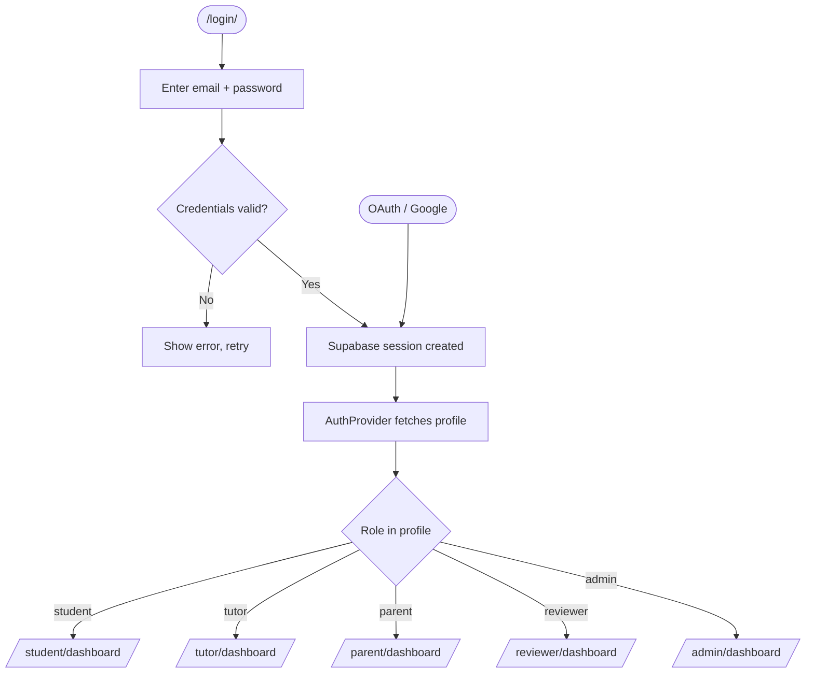

### 1.3 Password Reset

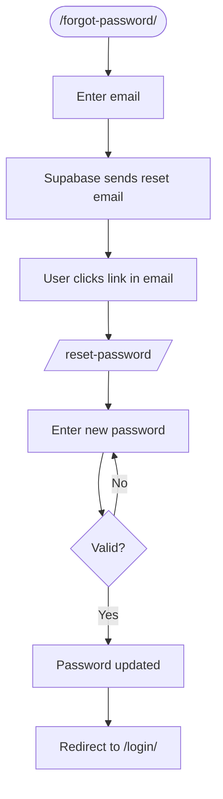

---

## 2. Parent Flows

### 2.1 Parent Dashboard Overview

```mermaid
flowchart LR
    P([/parent/dashboard/]) --> A[Profile Header\nAvatar upload]
    P --> B[Children List\nColor-coded cards]
    P --> C[Upcoming Sessions\nNext 5 bookings]
    P --> D[Recent Bookings]
    P --> E[Recent Payments]

    B --> B1[Click child card]
    B1 --> B2[/parent/child/childId/\nChild profile + stats]
    B2 --> B3[/parent/child/childId/bookings/]
    B2 --> B4[/parent/child/childId/sessions/]
    B2 --> B5[/parent/child/childId/ratings/]
```

### 2.2 Add / Link a Child

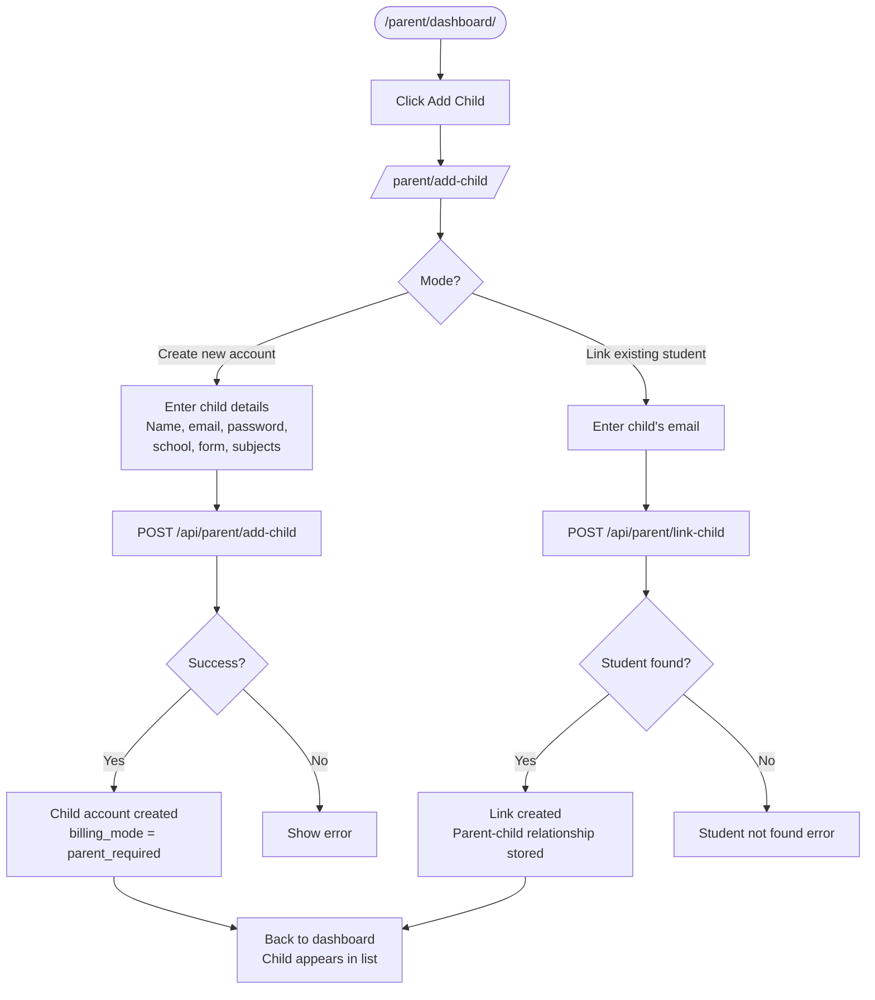

### 2.3 Approve a Booking

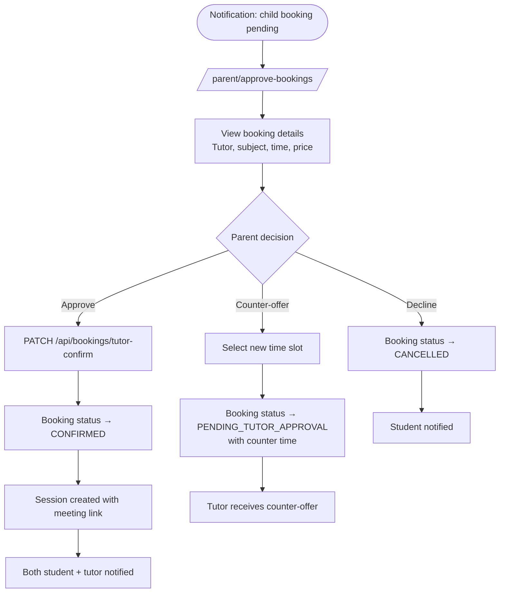

### 2.4 View Session Feedback

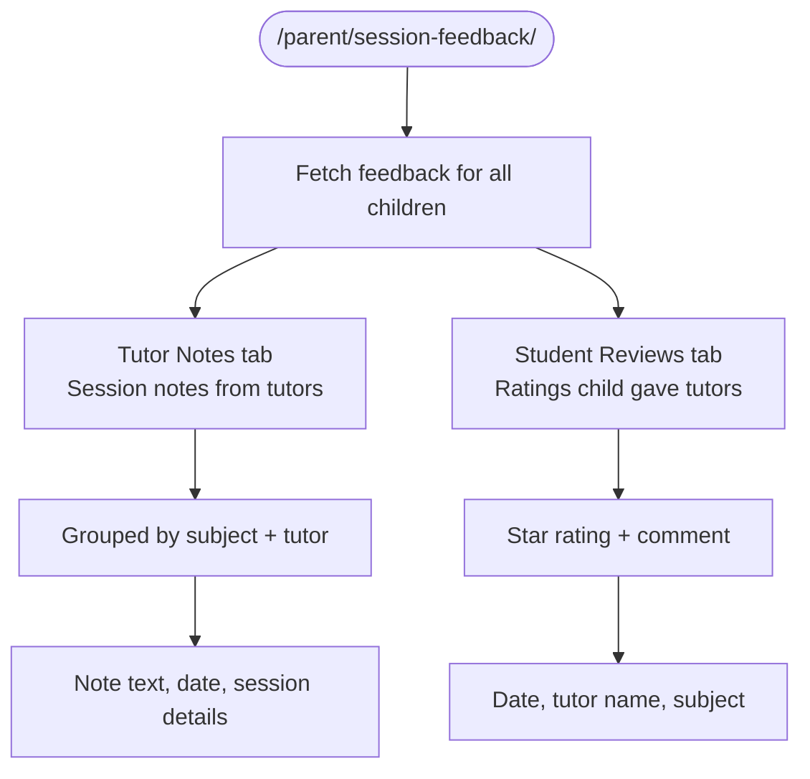

### 2.5 Parent Messaging

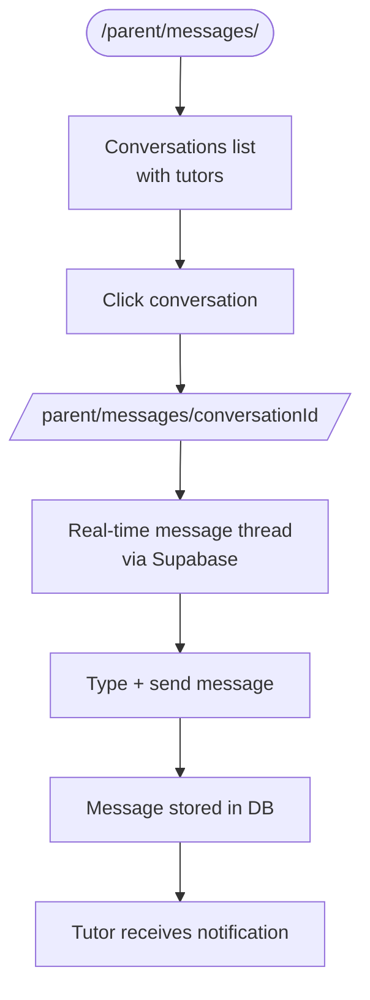

---

## 3. Student Flows

### 3.1 Student Dashboard Overview

```mermaid
flowchart LR
    S([/student/dashboard/]) --> A[Welcome Header\nProfile snapshot]
    S --> B[Stats Row\nHours · Rating · Reviews]
    S --> C[Upcoming Sessions\nNext 5]
    S --> D[Lesson Offers\nOffers from tutors]
    S --> E[Learning Journey]
    S --> F[Recent Tutors]

    C --> C1[Click session\nView details / join link]
    D --> D1[Accept or decline offer]
    F --> F1[/student/tutors/tutorId/\nFull tutor profile]
```

### 3.2 Find & Book a Tutor

```mermaid
flowchart TD
    A([/student/find-tutors/]) --> B[Browse tutor cards\nAvatar · Name · Bio · Rating]
    B --> C[Apply filters\nSubject · Rating · Price · School]
    C --> D[Pagination — 12 per page]
    D --> E[Click tutor card]
    E --> F[/student/tutors/tutorId/\nFull profile + reviews]
    F --> G[Select subject + time slot]
    G --> H[POST /api/bookings/create]
    H --> I{billing_mode?}

    I -- self_allowed --> J[Booking status:\nPENDING_TUTOR_APPROVAL]
    I -- parent_required --> K[Booking status:\nPENDING_PARENT_APPROVAL]

    J --> L[Tutor receives request\nSee Tutor: Handle Booking]
    K --> M[Parent receives approval request\nSee Parent: Approve Booking]
```

### 3.3 Manage Bookings

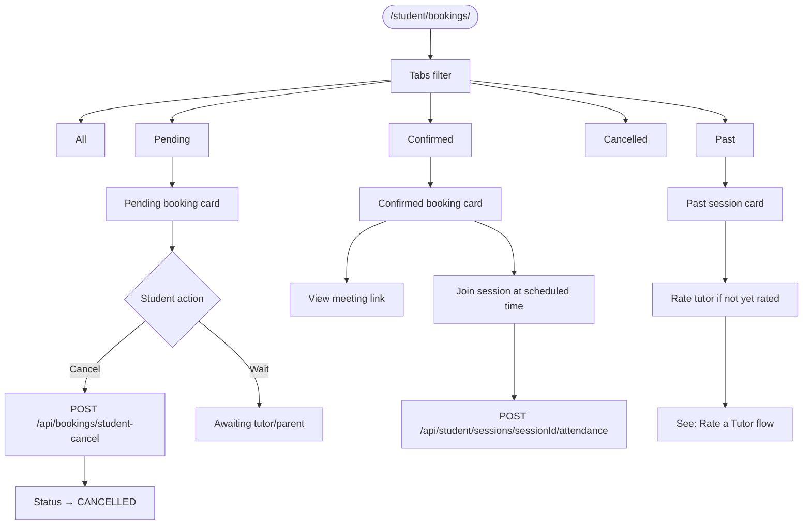

### 3.4 Rate a Tutor

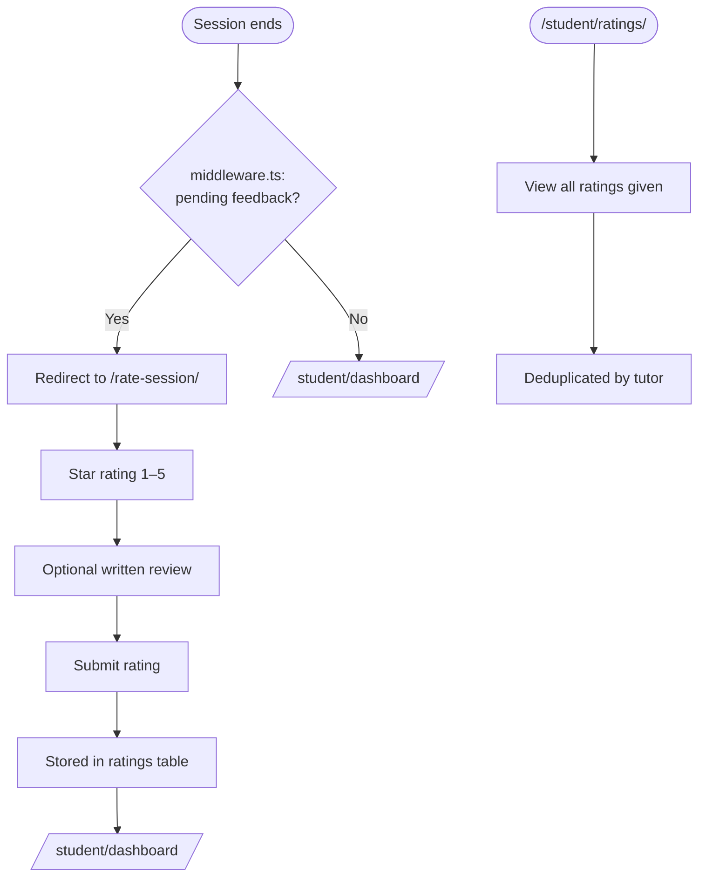

### 3.5 Curriculum & Syllabus

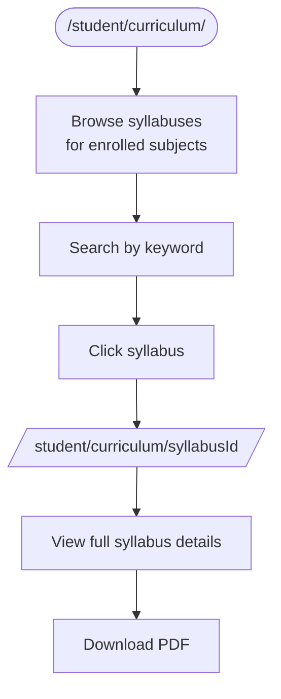

---

## 4. Tutor Flows

### 4.1 Tutor Dashboard Overview

```mermaid
flowchart LR
    T([/tutor/dashboard/]) --> A[Profile Header\nAvatar · Banner · Bio · Edit]
    T --> B[Verification Badge\nStatus indicator]
    T --> C[Subjects + Pricing\nAdd / edit subjects]
    T --> D[Upcoming Sessions\nNext 5]
    T --> E[Sent Offers\nOffers sent to students]
    T --> F[Rating & Reviews\nAverage + recent]
    T --> G[Video Provider\nConnection status]

    B --> B1[/tutor/verification/\nSee Verification Flow]
    C --> C1[Modal: add subject\nSubject · Price · Level]
    G --> G1[/tutor/video-setup/\nSee Video Setup]
```

### 4.2 Handle a Booking Request

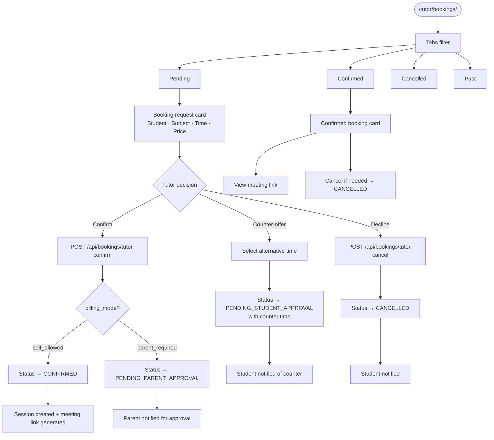

### 4.3 Set Availability

```mermaid
flowchart TD
    A([/tutor/availability/]) --> B[Availability Rules Section]
    B --> C[Add weekly rule\nDay · Start time · End time\nSlot duration · Buffer]
    C --> D[Saved to tutor_availability_rules]

    A --> E[Unavailability Blocks Section]
    E --> F[Add date range block\nStart date · End date · Reason optional]
    F --> G[Saved to tutor_unavailability_blocks]

    A --> H[/tutor/calendar/\nWeek view]
    H --> I[See confirmed bookings\nas calendar events]
    H --> J[See availability rules\nas background slots]
    H --> K[Navigate by week]

    D --> L[Students can only book\nwithin available slots]
    G --> L
```

### 4.4 Verification Flow

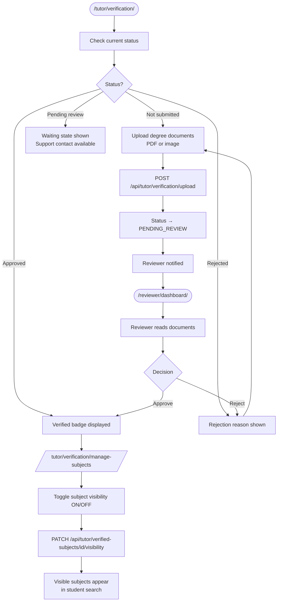

### 4.5 Find Students & Send Offers

```mermaid
flowchart TD
    A([/tutor/find-students/]) --> B[Browse student cards\nAvatar · Name · School · Form level]
    B --> C[Apply filters\nForm level · School · Subjects]
    C --> D[Pagination — 12 per page]
    D --> E[Click student card]
    E --> F[/tutor/students/studentId/\nFull student profile]
    F --> G[Send lesson offer]
    G --> H[Offer appears on student dashboard\nunder Lesson Offers]
    H --> I{Student response}
    I -- Accept --> J[Booking created\nStatus → PENDING_TUTOR_APPROVAL]
    I -- Decline --> K[Offer removed]
```

### 4.6 Video Provider Setup

```mermaid
flowchart TD
    A([/tutor/video-setup/]) --> B{Provider choice}

    B -- Google Meet --> C[Connect Google account\nOAuth flow]
    C --> D[Google OAuth consent]
    D --> E[/auth/callback — tokens stored\nencrypted with TOKEN_ENCRYPTION_KEY]
    E --> F[Status: Google Meet connected]

    B -- Zoom --> G[Connect Zoom account\nOAuth flow]
    G --> H[Zoom OAuth consent]
    H --> E
    E --> I[Status: Zoom connected]

    F --> J[Meeting links auto-generated\nfor confirmed sessions]
    I --> J
```

---

## 5. Shared Flows

### 5.1 Full Booking Lifecycle

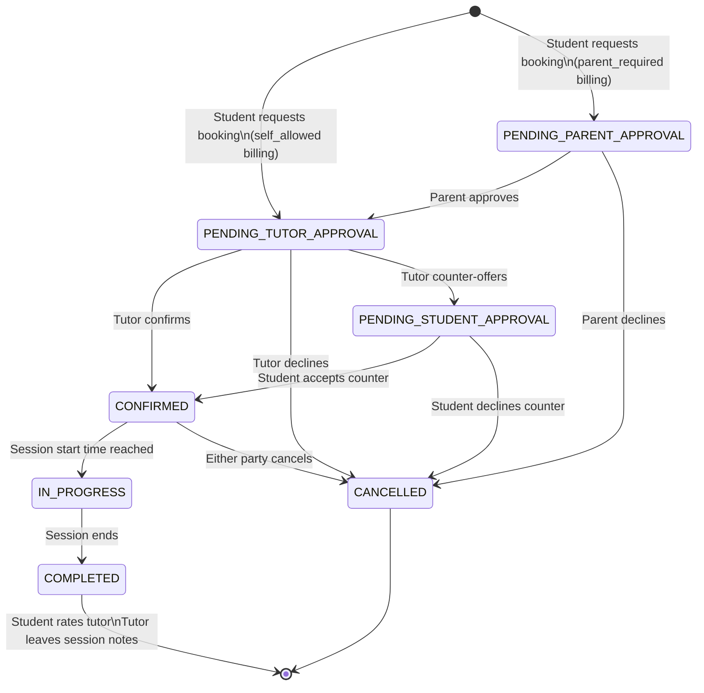

### 5.2 Messaging (All Roles)

```mermaid
flowchart TD
    A([Any role: /messages/]) --> B[Conversations list\nSorted by latest message]
    B --> C[Click conversation]
    C --> D[/messages/conversationId/\nReal-time thread via Supabase]
    D --> E[View message history]
    E --> F[Type message]
    F --> G[Send]
    G --> H[INSERT into messages table]
    H --> I[Supabase realtime\npushes to recipient]
    I --> J[Recipient sees message\nin real time]
    J --> K[Push notification\nif recipient offline]

    L[New conversation] --> M[Find user via search\nor from their profile]
    M --> N[POST /api/conversations/create]
    N --> D
```

### 5.3 Groups & Communities

```mermaid
flowchart TD
    A([/groups/]) --> B{Feature flag:\nisGroupsFeatureEnabled?}
    B -- No --> C[Redirect to dashboard]
    B -- Yes --> D[Browse group classes]
    D --> E[/groups/groupId/]
    E --> F[Tabs: Feed · Members · Sessions · Reviews]

    F --> G[Enroll in group]
    G --> H[POST /api/groups/groupId/enroll]
    H --> I[/student/groups/\nMy enrolled groups]

    E --> J[Group sessions list]
    J --> K[/api/groups/groupId/sessions/sessionId/\nOccurrence details]
    K --> L[RSVP to occurrence]
    L --> M[/api/groups/.../rsvp]
    M --> N[Get meeting link at session time]
    N --> O[/api/groups/.../join-link]

    P([/communities/]) --> Q{Feature flag:\nisCommunitiesArchived?}
    Q -- Yes --> R[Redirect to dashboard]
    Q -- No --> S[Browse subject communities]
    S --> T[/communities/communityId/\nQ&A feed]
    T --> U[Post question]
    T --> V[Answer question]
    T --> W[/communities/communityId/q/questionId/\nQuestion + answers]
```

### 5.4 Cron Jobs (Background Tasks)

```mermaid
flowchart LR
    CRON[Scheduler] --> A[/api/cron/send-reminders/\nSession reminders to users]
    CRON --> B[/api/cron/process-charges/\nProcess session payments via WiPay]
    CRON --> C[/api/cron/send-onboarding-emails/\nOnboarding email sequences]

    A --> D[notificationService\nPush + email]
    B --> E[commissionCalculator\nTutor earnings after platform cut]
    C --> F[emailService\nResend API]

    G[CRON_SECRET header] --> A
    G --> B
    G --> C
```

---

## Role Access Summary

| Feature | Student | Tutor | Parent |
|---|:---:|:---:|:---:|
| Dashboard | ✅ | ✅ | ✅ |
| Find tutors | ✅ | — | ✅ |
| Find students | — | ✅ | — |
| Request booking | ✅ | — | — |
| Confirm/decline booking | — | ✅ | — |
| Approve child booking | — | — | ✅ |
| Set availability | — | ✅ | — |
| Verification upload | — | ✅ | — |
| Session feedback notes | — | ✅ (write) | ✅ (read) |
| Rate tutor | ✅ | — | — |
| Messaging | ✅ | ✅ | ✅ |
| Curriculum | ✅ | ✅ | — |
| Groups | ✅ | ✅ | — |
| Communities | ✅ | ✅ | ✅ |
| Add/manage children | — | — | ✅ |
| Video provider setup | — | ✅ | — |
